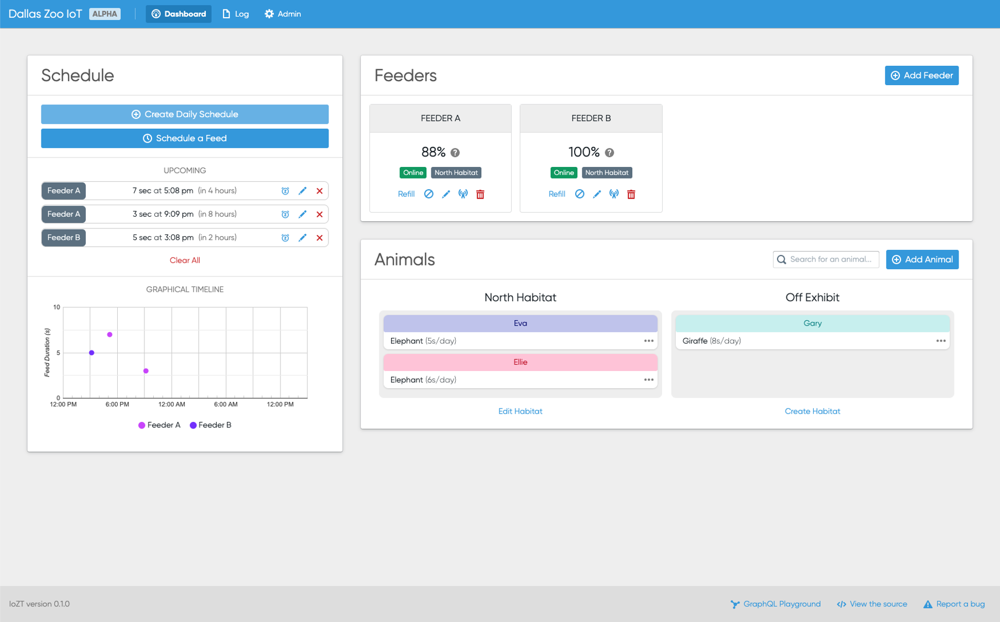

# Dallas IoZT 🐘 

## Contents 

1. [Developer Overview 🚀](#1_Developer_Overview_)
2. [Developer Setup ⚙️](#2_Developer_Setup_)
    1. [Ensure you have the following downloaded:](#3_Ensure_you_have_the_following_downloaded)
    2. [Clone this repository](#4_Clone_this_repository)
    3. [Install all dependencies](#5_Install_all_dependencies)
    4. [Create a .env file](#6_Create_a_env_file)
3. [Developer Tools Included](#7_Developer_Tools_Included)
    1. [ESLint](#8_ESLint)
    2. [Storybook](#9_Storybook)
4. [How to run](#10_How_to_run)
5. [Codebase Architecture 🏗](#11_Codebase_Architecture_)
6. [Deployment](#12_Deployment)

## Developer Overview 🚀 

As a quick overview, here's the architecture of the web app:

* Frontend
  * [React](https://reactjs.org/docs/getting-started.html): JavaScript framework for building modular frontend components
  * [Next.js](https://nextjs.org/): Renders static webpages and serves them from the Node backend (API also includes page routing, etc.)
  * [tailwindcss](https://tailwindcss.com/): CSS framework used to easily create responsive designs
    * Keeps sizing based on relative sizes (like `rem`) rather than absolute pixels
    * Declutters app CSS
  * [Blueprint](https://blueprintjs.com/docs/#core/): UI component library
  * [styled-components](https://styled-components.com/docs/): Allows React components to be extended with CSS interwoven (primarily used for edge cases that `tailwind` can't easily tackle)
* Backend
  * Node.js/Express.js: Creates a server using JavaScript
  * [Apollo GraphQL](https://www.apollographql.com/docs/): Allows interaction between the client and server using a data graph rather than a REST API
* Database
  * [NeDB](https://github.com/louischatriot/nedb): NoSQL lite database solution
    * Functionally similar to older versions of MongoDB. Check the documentation for further information.

## Developer Setup ⚙️ 

### Ensure you have the following downloaded: 

* [Node.js/NPM](https://nodejs.org/en/)
* [Yarn](https://yarnpkg.com/getting-started/install) (optional): Replaces `NPM` as your package manager. I prefer `Yarn` but they're very similar so it's not a huge deal. You can install `Yarn` with `npm install -g yarn`.

### Clone this repository 

Get the repository `git` URL and run `git clone your-url-here` after navigating to wherever you'd like to download this codebase on your device.

### Install all dependencies 

Run either `npm install` or `yarn install`. You may have to configure a [proxy](https://www.jhipster.tech/configuring-a-corporate-proxy/) with your package manager if you're on the VPN.

### Create a .env file 

Create a file named `.env` at the root of this project. This file will contain all of your environment variables. Check out the `.env.example` file for guidance.

## Developer Tools Included 

The following developer tools are included to make collaboration a little smoother:

### ESLint 

This linter will check coding style and will warn you when you've written any code that violates the code guidelines. Run `npm run lint --fix` or `yarn lint --fix` to run the linter and automatically fix anything that can be fixed by ESLint.

There's also a precommit git hook which requires the code to pass the linter before allowing a commit.

### Storybook 

Storybook enables developers to write MDX files (markdown that can include JSX, or the HTML-esque markup used in React), which allows self-documentation of reusable modules. To view this documentation, run `npm run storybook` or `yarn storybook`. You can create and edit any component stories that exist in the `/components/stories` directory. This functionality is primarily reserved for primitives, not larger, more specific components or any components that require any API queries.

## How to run 

`npm run dev` or `yarn dev` will start a development server and allow you to access the app in the browser, automatically reloading anytime you save a file.

`npm start` or `yarn start` will do the same, but won't reload when the backend changes.

## Codebase Architecture 🏗 

Beginning a the root directory,

* `/components` contains reusable React components, which can be imported into any React file. `/components/layout` specify layout components such as the Navbar, Side Menu, and Footer, `/components/pages` specify components that correspond to individual pages (ex. tables that appear on certain pages), and `/components/primitives` specify primitives which are reused throughout the application, such as Buttons. Additionally, `/components/providers` contains higher-order components, such as a theme wrapper or a wrapper to pass the currently logged-in user as a property.

* `/pages` contains the individual routed pages, such as the homepage (`index.js`) or the users page (`users.js`). Creating a new file in this directory creates a new route with the same name. Nested routes can be created using folders.

* `/server` contains all the backend code for the GraphQL API. `/server/types` declare the GraphQL resolvers (like a header file). and `/server/resolvers` define those functions. When a request is made by the client, the corresponding resolver will be executed.

* `/utils` contains globally-utilized code segments, including helper functions, GraphQL queries to be referenced by the client, React hooks, and data models.

* `.eslintrc` defines the ESLint ruleset--if any rules need to be modified or ignored altogether, that can be done here.

* `tailwind.config.js` defines the configuration for the `tailwindcss` classes. This includes global theme elements, such as the primary blue color used throughout the site.

## Deployment 

This application is being superficially tested on Heroku, which maintains a [dev deployment](https://iozt-dev.herokuapp.com/) and a [prod deployment](https://iozt.herokuapp.com). These are simply to allow user testing of latest versions of the UI, and are not connected to any real feeder devices. When deploying to Heroku, the `HEROKU=true` environment variable must be added to bypass the requirement of having a Lora controller service URL in a production mode.

