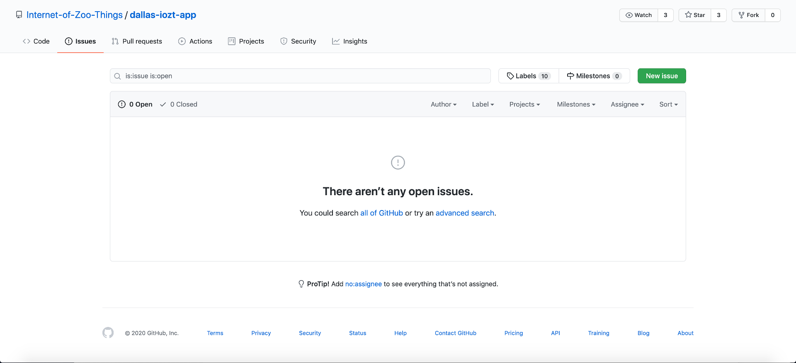
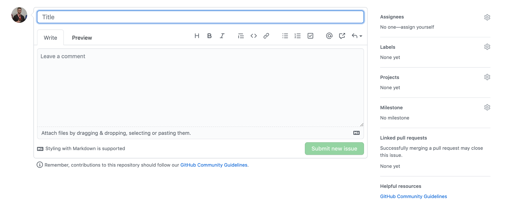
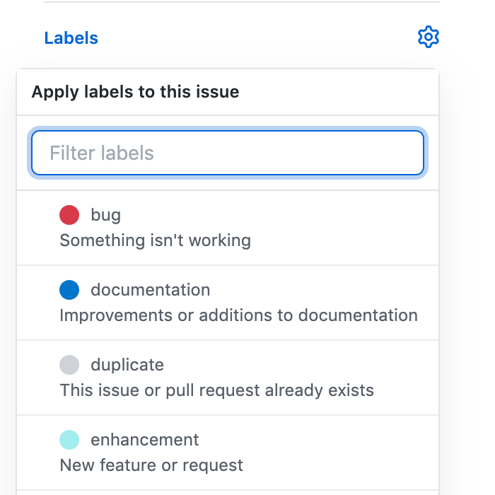

# Reporting a Bug

You can report a bug, a feature request, an enhancement, or anything else on the project's Github page! Navigate to [this page](https://github.com/Internet-of-Zoo-Things/dallas-iozt-app/issues) and you should see a screen that looks like this:

Click on the green `New Issue` button on the right-hand side of the page. If you don't already have a Github account, you'll have to sign up for one before you can create a new issue. Once you've done this, you'll be able to create a title and write out details for your issue here:

Make sure to include any screenshots if you've encountered a bug in the web application, as this will allow us to better diagnose your problem! You can upload images or paste them into the description box. You can also add a label to your issue here:

...and that's it--once you submit your issue, the development team will be notified!
